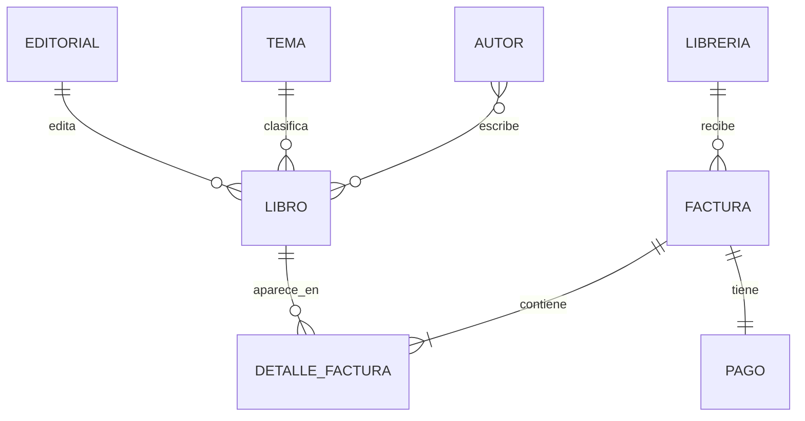

# Distribuidora — lectura moderna

Entidades identificadas en el diagrama original: **LIBRO, EDITORIAL, TEMA, AUTOR, FACTURA, LIBRERÍA, PAGO** y el detalle de factura.

La vista Mermaid prioriza legibilidad y normalización. Los ficheros Dia originales son la referencia histórica para las cardinalidades.
