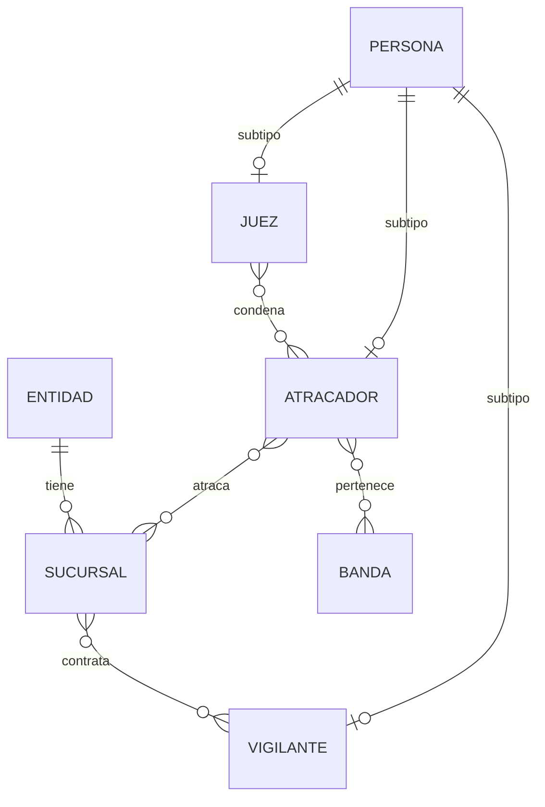

# Ejercicio 13 — lectura moderna

El original modela personas, sucursales, vigilantes, atracadores, bandas y jueces, con relaciones de contratación, pertenencia y atraco.

```mermaid
erDiagram
  ENTIDAD ||--o{ SUCURSAL : tiene
  PERSONA ||--o| VIGILANTE : subtipo
  PERSONA ||--o| ATRACADOR : subtipo
  PERSONA ||--o| JUEZ : subtipo
  SUCURSAL }o--o{ VIGILANTE : contrata
  ATRACADOR }o--o{ BANDA : pertenece
  ATRACADOR }o--o{ SUCURSAL : atraca
  JUEZ }o--o{ ATRACADOR : condena
```
