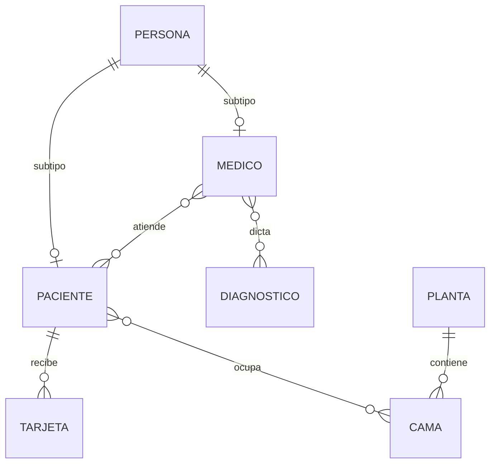

# Ejercicio 14 — lectura moderna

El original modela pacientes, médicos, diagnósticos, camas, plantas y una tarjeta de estancia/entrada-salida.

```mermaid
erDiagram
  PERSONA ||--o| PACIENTE : subtipo
  PERSONA ||--o| MEDICO : subtipo
  PACIENTE ||--o{ TARJETA : recibe
  MEDICO }o--o{ PACIENTE : atiende
  MEDICO }o--o{ DIAGNOSTICO : dicta
  PACIENTE }o--o{ CAMA : ocupa
  PLANTA ||--o{ CAMA : contiene
```
